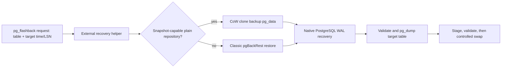

# Large database restore PoC results

- Date: 2026-07-16
- Branch: `large-db-poc`
- PostgreSQL: 17.3
- pgBackRest: 2.53.1
- Filesystem: XFS, `reflink=1`

## Outcome

The repository snapshot-direct path is technically valid on this host and is
the recommended first large-database recovery engine for pg_flashback.

It is not a trade-off-free or universal replacement for pgBackRest restore:

- it requires a plain, uncompressed, non-bundled, non-block repository with
  hardlinks enabled;
- it requires a filesystem snapshot or reflink provider;
- it still replays every relevant WAL record between the backup and target;
- it still exports and imports the complete target table.

The important result is narrower and useful: **the initial full-cluster copy can
be removed from RTO without implementing PostgreSQL redo ourselves.**

## Correctness

Every measured run used this timeline:

1. create target and noise data;
2. take a full pgBackRest backup;
3. commit target-table updates and a sentinel row;
4. record the PITR target time and fingerprint;
5. drop the target table later;
6. recover through classic restore and snapshot-direct independently;
7. compare `count`, `sum(id)`, sentinel count, and a payload hash aggregate;
8. extract the recovered table with `pg_dump`.

All classic and snapshot fingerprints matched the pre-DROP fingerprint exactly.
Dump sizes also matched within each run.

## Low-WAL results

The target table was 20% of the generated dataset. Only 1,000 target rows were
changed between backup and the PITR target.

| Requested | Actual DB | Target table | Classic RTO | Snapshot RTO | Speedup | Classic allocation | Snapshot allocation | Reflink clone |
|---:|---:|---:|---:|---:|---:|---:|---:|---:|
| 500 MiB | 531 MiB | 105 MiB | 1,759 ms | 808 ms | 2.18x | 813 MiB | 115 MiB | 26 ms / 40 KiB |
| 1,024 MiB | 1.05 GiB | 214 MiB | 3,136 ms | 1,277 ms | 2.46x | 1.46 GiB | 115 MiB | 29 ms / 136 KiB |
| 2,048 MiB | 2.10 GiB | 429 MiB | 5,120 ms | 2,465 ms | 2.08x | 2.50 GiB | 115 MiB | 28 ms / 40 KiB |

Observed behavior:

- classic restore time and allocation increase with cluster size;
- reflink clone remained 22-29 ms and allocated only metadata blocks;
- snapshot recovery allocation stayed near 115 MiB in the low-WAL runs;
- snapshot RTO was dominated by exporting the target table: 69%, 81%, and
  86% as target-table size increased.

This is the desired scaling boundary: cluster materialization is no longer the
dominant cost; target-table transfer becomes the lower bound.

## High-WAL sensitivity

The stress run used a 1.05 GiB database, a 54 MiB target table (5%), and updated
510,027 noise-table rows (50%) after the backup but before the PITR target.

| Path | Materialize | WAL recovery | Extract | Total RTO | Total allocation |
|---|---:|---:|---:|---:|---:|
| Classic | 1,599 ms | 3,571 ms | 290 ms | 5,460 ms | 3.88 GiB |
| Snapshot-direct | 22 ms | 3,509 ms | 289 ms | 3,820 ms | 2.60 GiB |

The repository grew from 1.11 GiB after backup to 2.20 GiB after archived WAL.
Both paths paid essentially the same 3.5-second replay cost. Snapshot-direct was
still 1.43x faster because it avoided the initial cluster copy, but its advantage
fell from roughly 2.1-2.5x to 1.43x. CoW writes also grew with WAL churn.

This closes an important misconception: snapshot-direct makes materialization
cheap; it does **not** make heavy WAL replay cheap.

## Architecture decision

Use a two-engine recovery helper, with snapshot-direct preferred and classic
pgBackRest restore as the compatibility fallback:

Responsibilities remain separated:

- **pg_flashback extension**: tracked-table policy, schema history, target
  timestamp/LSN, audit/RBAC, restore request and final controlled swap.
- **external recovery helper**: backup discovery, capability checks, clone or
  restore, isolated PostgreSQL lifecycle, WAL recovery, table extraction and
  cleanup.
- **PostgreSQL**: physical redo, visibility, TOAST, catalog and row correctness.

Do not implement relation-level WAL redo now. The measurements do not justify
accepting that correctness and version-maintenance risk yet. Revisit surgical
WAL filtering only if production-scale measurements show that WAL replay, not
table export, consistently dominates required RTO.

## Product boundary

This fast path should be advertised as **backup-backed table flashback**, not as
trade-off-free recovery:

- fastest supported path: plain pgBackRest repository + CoW snapshot provider;
- portable fallback: classic pgBackRest restore;
- immediate DROP path: the separate pg_recyclebin project;
- no backup/snapshot/WAL means no guaranteed recovery.

The existing pg_flashback full-table base snapshot and periodic checkpoint
strategy is still unsuitable for large tables. A later integration change must
add a backup-backed tracking profile that does not create those full local table
copies.

## Unclosed risks before product integration

- incremental/differential backup sets and hardlink closure
- tablespaces and symlink mapping
- encrypted repositories
- required extension/shared-library availability in the temporary instance
- PostgreSQL major-version binary selection
- cancellation, quotas and crash-safe cleanup
- importing very large tables and minimizing the final production swap window
- a production-like high-WAL benchmark on larger external storage

These are integration gates, not reasons to discard the measured snapshot path.
