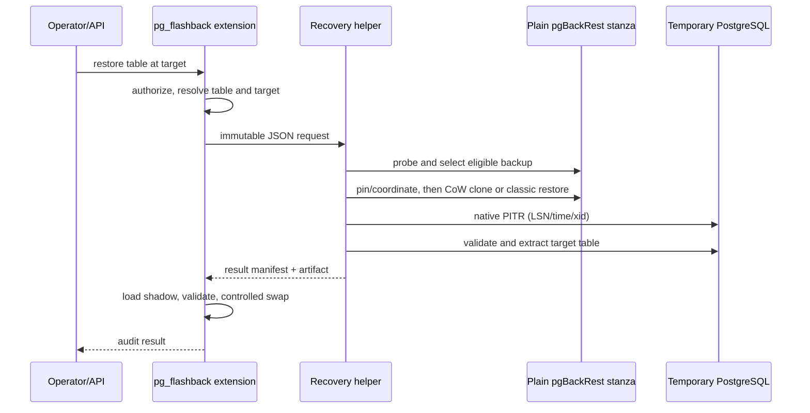

# External recovery helper design

- Status: phase-1 contract and planning skeleton
- Scope: backup-backed table recovery for large databases

## Decision

Large-table recovery runs outside the PostgreSQL backend. The extension owns
policy and the final table swap; a least-privileged helper owns temporary
cluster materialization, native PostgreSQL recovery and table extraction.

The helper is a second binary in this repository, not a second product or a
fork of pgBackRest. It never implements WAL redo itself.



## Tracking profiles

The profiles must remain explicit because they make different storage and RTO
promises.

| Profile | Base/checkpoint tables | Row DML delta | DDL metadata | Recovery source |
|---|---|---|---|---|
| `local_delta` | yes | yes | yes | existing in-database replay |
| `backup` | no | no | yes | physical backup + archived WAL |
| `hybrid` (future) | no | selected/short-window | yes | helper, with optional local acceleration |

The `backup` profile deliberately does **not** keep complete row deltas. Native
physical recovery already replays those changes; duplicating every row image in
`delta_log` would recreate the write and storage cost this profile is meant to
avoid. It records schema history, DDL/disaster markers, recovery coverage and
audit metadata only.

The existing one-argument `flashback_track(text)` remains `local_delta` for
backward compatibility. A later SQL migration should add an explicit overload
or dedicated API for the backup profile. That migration also needs to make
`tracked_tables.base_snapshot_table` nullable and add at least:

- `recovery_profile` (`local_delta` or `backup`);
- approved helper profile/stanza name and repository key;
- first covered backup time/LSN;
- latest verified archive time/LSN;
- last capability-probe result and timestamp.

## Command surface

The initial CLI is `pg-flashback-recovery`.

```text
pg-flashback-recovery probe --config helper.json
pg-flashback-recovery plan --config helper.json --request request.json
pg-flashback-recovery restore-table --config helper.json --request request.json
```

- `probe` performs non-destructive binary/repository checks, ensures the work
  root and coordination lock can be opened, and runs a disposable CoW clone
  test under `work_root`.
- `plan` does not create or start a PostgreSQL cluster. Its capability probe
  may create the configured work-root/lock paths. It selects the newest
  eligible full backup at or before the target and returns the chosen engine
  and exact phases as JSON.
- `restore-table` is present but fails closed in the phase-1 skeleton. It must
  not execute until pinning, quotas, cancellation and crash cleanup are covered
  by end-to-end tests.

All successful output is JSON on stdout. Structured errors are JSON on stderr
and carry a stable error code. Secrets are never accepted in the request and
must remain in the pgBackRest configuration/credential provider.

## Configuration contract

Configuration is operator-owned and maps a logical helper profile to one
approved stanza **and repository key**. A restore request cannot supply
executable paths, repository paths, ports or arbitrary pgBackRest options.

```json
{
  "profile": "flashback_plain",
  "pgbackrest_bin": "/usr/local/bin/pgbackrest",
  "pgbackrest_config": "/etc/pgbackrest/pgbackrest-flashback.conf",
  "pg_bin_dir": "/usr/local/pgsql-17/bin",
  "cp_bin": "/usr/bin/cp",
  "repository_path": "/var/lib/pgbackrest-flashback",
  "repository_key": 1,
  "stanza": "app_flashback",
  "work_root": "/var/lib/pg_flashback/recovery",
  "snapshot_provider": "xfs_reflink",
  "expire_lock_path": "/run/lock/pg_flashback/app_flashback.lock",
  "max_work_bytes": 536870912000
}
```

The fast path currently supports a local POSIX repository whose chosen backup
contains a directly readable `pg_data` tree. Snapshot eligibility is proved
from the backup tree and an actual `cp --reflink=always` test; it is never
inferred only from filesystem type.

## Restore request contract

The extension/controller creates the request. The helper validates every field
and derives all working/output paths from `request_id` and `work_root`.

```json
{
  "request_id": "fb-20260716-000001",
  "database": "appdb",
  "table": {"schema": "public", "name": "orders", "rel_oid": 16384},
  "target": {
    "kind": "lsn",
    "value": "0/16B6C50",
    "observed_at_unix_seconds": 1784180000,
    "inclusive": true
  },
  "expected_schema_version": 7,
  "expected_fingerprint": null
}
```

`target.kind` is one of:

- `lsn`: precise known point; normally sourced from commit-LSN metadata;
- `time`: operator-selected wall-clock target;
- `xid`: DDL disaster transaction, normally with `inclusive=false` to stop
  before the DROP/TRUNCATE transaction commits.

The first skeleton plans LSN targets. Time/XID execution remains in the
contract so the implementation cannot accidentally force DROP recovery through
an imprecise “one millisecond earlier” convention.

## Planning rules

1. Reject an invalid request, non-absolute operator path, missing binary, busy
   repository or unhealthy stanza.
2. Read `pgbackrest info --output=json` using a fixed argument vector.
3. For phase 1, consider completed **full** backups only. Differential and
   incremental closure is an explicit later gate.
4. Select the newest backup whose stop LSN is not later than the target LSN.
5. If none exists, return `target_before_oldest_backup`; never silently select
   the oldest backup.
6. Prefer `snapshot_direct` only when a direct backup tree, CoW probe and expire
   coordination are all valid; otherwise plan `classic_restore`.
7. Re-check the selected label and repository lock after acquiring execution
   coordination. Planning alone never reserves a backup.

## Backup/expire coordination

pgBackRest serializes `backup` and `expire` with its internal backup lock, but
the helper's direct filesystem clone is not a pgBackRest command and therefore
does not automatically participate in that lock.

For production, the dedicated flashback stanza must route scheduled backup and
expire commands through an operator wrapper that takes an exclusive `flock` on
`expire_lock_path`. The helper executor takes a shared lock from selection
through creation of its private pinned/CoW tree. A lock-status check before the
operation is useful but is not an atomic replacement for this coordination.

Backup annotations are audit metadata, not retention pins. Until an atomic pin
mechanism is implemented and tested, snapshot execution fails closed when the
external lock contract is not configured.

After the shared lock is held, the executor will:

1. re-read `pgbackrest info` and confirm the selected label still exists;
2. create a private reflink tree under the request work directory;
3. verify required manifest/control files;
4. release the shared repository lock only after the private tree is complete.

An expire after this point may remove repository names, but it cannot remove
the private CoW extents needed by the running recovery.

## Separate plain recovery repository

The fast path must not force an organization to replace its normal compressed,
encrypted or object-store backup policy. The deployment pattern is:

- normal pgBackRest repository: long retention and disaster recovery;
- an additional repository key in the **same stanza**: local, short-retention,
  plain backup sets on snapshot-capable storage;
- backup jobs scheduled independently per repository, with the flashback-tier
  backup command using no compression, bundling or block incremental storage;
- WAL retention that keeps continuous coverage for every advertised flashback
  target in the selected recovery repository.

pgBackRest repository options such as hardlink, bundle and block are keyed by
repository, while backup compression can be set on the flashback-tier backup
invocation. Keeping the same stanza also avoids inventing a second archive
pipeline for the same PostgreSQL cluster.

If operational constraints require a separate stanza, the deployment must add
and test a dual archive-push wrapper, including partial failure and backpressure
semantics. A second stanza is therefore a supported future topology, not the
default recommendation.

This additional repository is an acceleration tier, not the only backup. Its
capacity and retention are part of the product contract and monitoring surface.

## Execution lifecycle and cleanup

Each request owns one directory and one state manifest. State transitions are
append/fsync/rename durable:

```text
accepted -> planned -> materializing -> recovering -> extracting
         -> validating -> ready_for_import -> completed
                                      \-> failed -> cleaning -> cleaned
```

Required guarantees:

- request IDs are idempotency keys;
- all child processes run without a shell and in their own process group;
- cancellation terminates the process group, then stops temporary PostgreSQL;
- ports/socket directories are allocated per request;
- cleanup is retryable and only removes paths below the configured work root;
- startup reconciliation cleans abandoned non-terminal requests;
- byte, runtime and concurrency quotas are checked before materialization and
  while WAL replay grows the clone;
- no artifact is returned until fingerprint/schema validation succeeds.

## Extraction and import

The correctness baseline remains `pg_dump` custom format. The next optimization
benchmark should compare:

1. custom-format `pg_dump`/`pg_restore`;
2. parallel directory-format dump/restore;
3. binary `COPY` streamed from the temporary table into an extension-created
   production shadow table.

Binary COPY is promising because extraction dominates low-WAL RTO, but it must
not become the default before generated columns, TOAST, user-defined types,
partitioning, row security, cross-version behavior and cancellation are covered
by tests. Relation-level WAL filtering remains out of scope.

## Result contract

The executor returns a result manifest containing:

- request/profile IDs and selected engine;
- selected backup label and target kind/value;
- PostgreSQL and pgBackRest versions;
- recovered database/table identity and schema version;
- row count/fingerprint and artifact checksum;
- materialize, WAL recovery, extraction and total durations;
- allocated bytes and peak work-directory bytes;
- cleanup status and structured warnings.

The extension must revalidate the manifest before loading the shadow table. The
helper never performs the final production DROP/RENAME itself.

## Delivery gates

The executor can be enabled only after tests cover:

- full, differential and incremental backup closure;
- concurrent backup and expire races;
- target older than all backups and missing WAL;
- tablespaces and symlink escape prevention;
- encrypted/remote repository fallback;
- PostgreSQL major binary and extension/shared-library matching;
- quota exhaustion during replay;
- SIGINT/SIGTERM/kill recovery and restart reconciliation;
- large import, constraints and minimal-lock final swap.
