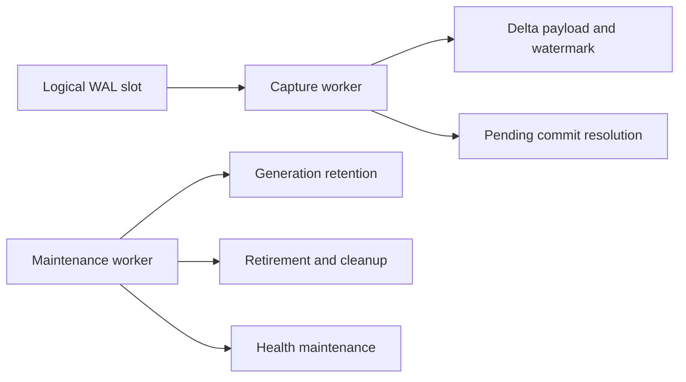

# Reliable v0.1.0 release plan

Status: **proposed execution plan — Milestone 0 docs contract freeze ready for
review; implementation gates remain open**

Last updated: 2026-07-17

This document turns the supported contract in
[`RELEASE_SCOPE.md`](RELEASE_SCOPE.md) and the publication gates in
[`RELEASE_CHECKLIST.md`](RELEASE_CHECKLIST.md) into an ordered execution plan
for the first reliable public release of pg_flashback.

The target is `v0.1.0`. It is not a promise that every PostgreSQL topology or
table shape is supported. It is a fail-closed release for the explicitly
qualified subset below.

## 1. Release objective

The first reliable release exposes two explicit recovery profiles:

| Profile | Intended use | Recovery evidence |
|---|---|---|
| `local_delta` | Small and medium tables that fit the configured local capacity and write-stall budget | Exact local base plus one contiguous logical-WAL COMMIT-LSN prefix |
| `backup` | Large tables or workloads that do not fit the local profile budget | Verified pgBackRest full-backup anchor plus contiguous archived WAL |

The extension does not select a profile from table size alone. The operator
selects a profile explicitly, and runtime admission checks prove that the
selected profile satisfies its capacity and correctness requirements.

The large-database objective means the backup profile is part of `v0.1.0`.
Publishing only the WAL-local profile would not satisfy the primary project
goal.

## 2. Current baseline

The current `large-db-poc` baseline already contains:

- WAL-only qualified local capture with COMMIT LSN as the canonical order;
- generation-aware target admission and persistent coverage gaps;
- generation-aware, resumable whole-generation retention;
- slot-loss, replacement, external-advance and capture-configuration
  invalidation;
- exact local base construction under the final relation lock;
- local restore bounded pre-swap drain proof with retry, shadow swap and
  pending successor activation;
- common lifecycle locking across restore, retention, re-anchor and untrack;
- hardened runtime payload ownership and API-only delegated administration;
- PostgreSQL 15–18 regression coverage;
- real WAL/worker E2E coverage;
- a recovery helper with snapshot-direct and classic pgBackRest engines;
- recovery-helper E2E coverage including identical recovered fingerprints.

Current implementation status on `work/v0.1.0-overnight`:

1. backup-profile generation wiring, authenticated proof installation,
   post-swap FULL re-anchor, durable coordinated expire, newer-timeline freeze
   and periodic missing-anchor detection are implemented and covered by the
   real-repository E2E;
2. fail-closed local capacity/write-stall admission
   (`flashback_advise` / shared budgets / OS free-space probe) and helper
   work-root capacity plus artifact GC are implemented; exact-RC qualification
   still required;
3. actionable `flashback_health()` slot/coverage reporting (including lag
   warning, post-swap `backup_reanchor_required`, and transactional
   `pg_flashback_action_required` NOTIFY) is implemented;
4. the recovery helper exposes an internal, unstable physical-recovery
   provider seam; pgBackRest remains the only qualified provider;
5. a bounded real-repository PoC proves retained pre-marker FULL + contiguous
   WAL recovery (including through shadow-swap) without changing the
   production FULL-after-marker activation contract — see
   `docs/RETAINED_FULL_WAL_POC.md`;
6. capture and bounded maintenance run in separate per-database workers; the
   exact-commit qualification harness enforces the stated p95/max SLOs;
7. release-mode packages build for PostgreSQL 15–18 and the helper; release
   versioning and clean-host installation remain open;
8. exact-RC 24-hour soak remains open;
9. aarch64 remains source-build only / not release-qualified;
10. do not claim 100+ GiB performance from current evidence.

## 3. Milestone 0 — Freeze the release contract

Estimated duration: **1–2 working days**

### Work

- Open a documentation-only pull request that freezes the `v0.1.0` supported
  contract. Do not mix implementation changes into this pull request.
- Audit the current `main` baseline and its merge history as input to the
  contract freeze. The `large-db-poc` pull request is already merged; do not
  reopen or re-diff that retired branch.
- Reconcile runtime behavior with `RELEASE_SCOPE.md`, `STORAGE_POLICY.md`,
  `COVERAGE_MODEL.md`, README and `RELEASE_CHECKLIST.md`.
- Update `OPERATIONAL_LIFECYCLE_AUDIT.md` so fixes that landed after the audit,
  including generation-aware retention, are no longer described as open.
- Correct `CHANGELOG.md`: `0.1.0` must not look published before the release
  gates pass.
- Remove hard-coded test-count claims. Qualification records report pass/fail
  for the exact commit and matrix entry instead of embedding a suite size in
  long-lived documentation.
- Keep aarch64 support consistently labeled as source-build only and not
  release-qualified across the README, release scope and release notes.
- Audit every public API and feature table entry for the words `supported`,
  `implemented`, `experimental`, `legacy` and `pending`.
- Ensure unsupported paths reject the request instead of returning an
  optimistic success result.

### Exit criteria

- Every behavior described as supported is implemented and tested.
- Every scaffold-only or experimental behavior is labeled as such.
- Documentation contains no known contradiction about open release blockers.
- The pull request diff contains documentation only and is clean and limited
  to the intended release-contract freeze.
- Each subsequent implementation milestone has its own pull request and is
  independently reviewable, testable and fail-closed.

## 4. Milestone 1 — Complete backup coverage lifecycle

Estimated duration: **7–10 working days**

This is the highest-risk implementation milestone.

### 4.1 Initial backup tracking

The required protocol is:

1. `flashback_track_backup()` creates a durable tracking marker.
2. The marker transaction commits before it can be resolved.
3. The worker resolves its real COMMIT LSN.
4. A backup that predates or overlaps that marker is rejected.
5. A new full backup must start strictly after the marker COMMIT LSN.
6. The completed backup is revalidated under the repository lock.
7. Only its verified stop boundary may activate the first generation.

Until step 7 completes, the lifecycle has zero active generations and restore
admission fails closed.

### 4.2 Immutable physical backup anchor

Each active backup generation must bind all of the following immutable
evidence:

- repository and stanza;
- backup label and `FULL` backup type;
- PostgreSQL system identifier;
- physical timeline;
- backup start and stop LSN;
- manifest identity and SHA-256;
- marker COMMIT LSN;
- tracking lifecycle ID;
- persisted inclusive physical-WAL `valid_through_lsn`.

Cross-lifecycle anchor use, mutable anchor fields and unverified catalog data
must fail closed.

### 4.3 Backup restore finalization

A production swap performed by the backup profile must:

1. validate and swap the imported table transactionally;
2. create a LOGGED pending transition marker;
3. resolve the real swap COMMIT LSN after commit;
4. seal the predecessor at that exclusive coordinate;
5. leave the successor `building` and unanchored;
6. preserve an intentional zero-active-generation state;
7. reject the interval from the swap commit through the next anchor;
8. require a new full backup that starts strictly after the swap commit;
9. activate only at that backup's verified stop boundary.

The system must never fall back to the predecessor while the successor is
unanchored.

### 4.4 Physical WAL frontier

- Advance `valid_through_lsn` only through a contiguous, revalidated archive
  prefix.
- Perform validation while holding the repository shared lock.
- Make backup and expire automation take the matching exclusive lock.
- Freeze coverage and open a durable gap on missing WAL, timeline mismatch or
  promotion.
- Prevent expire from removing any backup or WAL still pinned by an active or
  sealed generation.

### 4.5 Risk register

| Risk | Failure mode | Mitigation and release evidence |
|---|---|---|
| Timeline change or promotion | Archived WAL is interpreted across an invalid physical history | Bind the anchor to one timeline, freeze the frontier on mismatch and prove the durable gap with fault-injection E2E |
| Backup/expire/restore lock race | An anchor or required WAL is removed while being validated or restored | Use matching repository shared/exclusive locks, generation pins and deterministic race tests |
| Marker or swap resolution retry | A retry allocates duplicate generations or moves an immutable boundary | Persist idempotency identity, make resolution monotonic and exercise crash/restart retries |
| Mutable or stale backup metadata | Recoverability is claimed from catalog data that no longer identifies the same backup | Revalidate label, type, system ID, timeline, LSNs and manifest digest under the repository lock |
| Post-swap predecessor fallback | The system serves a target from a generation that no longer owns the interval | Preserve zero active generations, keep the gap durable and test admission while the successor is unanchored |
| Archive discontinuity | `valid_through_lsn` advances past missing or unverified WAL | Advance only through a contiguous revalidated prefix and freeze coverage at the last proven LSN |

Any unresolved risk above is a release blocker unless the affected path is
removed from the supported contract and fails closed.

### Qualification scenarios

- pre-existing full backup rejected;
- backup overlapping the marker rejected;
- differential/incremental backup rejected;
- wrong system identifier rejected;
- timeline mismatch opens a gap;
- changed manifest/digest rejected;
- missing archived WAL freezes the frontier;
- post-swap state contains zero active generations;
- a target in the unanchored interval is rejected;
- only a qualifying post-swap full backup re-anchors coverage;
- backup/expire and restore/expire races remain safe;
- retries of marker resolution and anchor activation are idempotent.

### Exit criteria

The backup profile cannot report recoverability from an unverified backup,
ambiguous timeline, incomplete archive prefix or unanchored post-swap state.

## 5. Milestone 2 — Bound capacity and artifact retention

Implementation status: **local capacity/write-stall admission and helper
work-root/GC controls are implemented; exact-RC soak and clean-host
packaged-artifact qualification remain open.**

Estimated duration: **3–5 working days**

### 5.1 Local-profile preflight

Track, re-anchor and restore must inspect:

- live heap, TOAST and index size;
- projected base-snapshot size;
- projected shadow-table size;
- retained generation/delta payload;
- filesystem free space;
- configured safety reserve;
- configured relation-lock timeout/write-stall budget.

The local restore peak is modeled conservatively as:

```text
required_peak_bytes =
    shadow_table_total
  + successor_base_heap
  + temporary_growth
  + safety_reserve
```

If the bound cannot be proven, the request is rejected before taking the final
table lock. No universal table-size threshold silently chooses the backup
profile.

### 5.2 Helper capacity controls

Implement:

- aggregate `work_root` byte quota;
- per-request byte quota;
- continuously enforced minimum free-space reserve;
- successful-artifact TTL;
- maximum retained artifact count/bytes;
- artifact pins for active or not-yet-imported results;
- `gc --dry-run` and `gc` commands;
- reconciliation of abandoned request directories;
- durable audit output for every GC decision.

Snapshot-direct CoW growth cannot be predicted exactly. Free space therefore
must be checked throughout replay and extraction, not only before execution.
Reserve exhaustion triggers controlled cancellation and cleanup.

### 5.3 Generation pins and lock interaction

- Active and sealed generations pin every backup, archived-WAL range, local
  payload and helper artifact still required for an admitted restore.
- Generation retirement and pin release occur under the common lifecycle lock.
- Repository expiration and backup-profile GC take the repository exclusive
  lock; anchor/frontier validation and restore use the matching shared lock.
- Helper artifact GC takes the per-request lock and revalidates durable pin
  state after acquiring it and immediately before deletion.
- Lock acquisition order is documented and consistent across retention,
  expire, restore and GC so that protection cannot be bypassed and deadlocks
  fail by timeout rather than partial cleanup.
- A failed expire or GC attempt records durable, retryable state and never
  releases the generation pin optimistically.

### Qualification scenarios

- insufficient local track/re-anchor space;
- insufficient local restore peak space;
- helper aggregate quota exhausted;
- free space falls below reserve during recovery;
- active artifact protected from GC;
- active and sealed generation payload protected from expire and GC;
- expired completed artifact removed;
- abandoned request reconciled;
- GC racing an active restore remains safe;
- generation retirement racing backup expire remains safe;
- lock timeout leaves pins and artifacts unchanged;
- failed cleanup is retryable and visible in health/state output.

### Exit criteria

All permanent and temporary storage has a measurable bound, and no supported
operation is allowed to fill the filesystem optimistically.

## 6. Milestone 3 — Isolate capture from maintenance

Implementation status: **COMPLETE; exact clean-commit evidence must accompany
the release candidate.** Each configured database has one capture process and
one independently scheduled maintenance process. The qualification harness
rejects a run unless both processes exist and measures each commit from its
own acknowledgement to first durable visibility.

Estimated duration: **3–4 working days**

The worker architecture should separate correctness-critical capture draining
from potentially slow maintenance:



### Capture worker responsibilities

- logical slot consumption;
- complete-transaction promotion;
- protected DDL promotion;
- pending generation COMMIT resolution;
- capture watermark advancement.

### Maintenance worker responsibilities

- generation retirement;
- retention and payload cleanup;
- bounded catalog/health maintenance;
- retry of committed maintenance intents.

### Scheduling rules

- Waiting on one table's maintenance lock must not delay capture for another
  table.
- Maintenance operations have timeouts, cancellation points and idempotent
  retries.
- Adaptive idle waiting is allowed only on the qualified WAL path.
- Restarting either worker resumes durable work without duplicating state.
- Worker count and resource use remain explicitly bounded.

### Qualification SLO

- A maintenance operation blocked for 30 seconds does not stop WAL capture.
- Under the qualification workload, commit visibility latency is below one
  second at p95.
- No qualifying transaction remains invisible for more than five seconds.
- Slot lag is observable and does not grow merely because maintenance is
  waiting on an unrelated table.

### Workload and measurement methodology

- Run a steady mixed-write workload against at least two tracked tables while
  generating unrelated WAL in another database.
- Include short transactions, long transactions and wide/TOASTed updates at a
  fixed, recorded transaction rate after a warm-up period.
- Hold one table's maintenance lifecycle lock for 30 seconds while writes and
  logical-slot consumption continue for the other table.
- Record each qualifying transaction's COMMIT LSN, monotonic commit-
  acknowledgement time and the first monotonic instant that the corresponding
  complete transaction is visible in the durable capture watermark. Compute
  visibility latency between the two monotonic timestamps and retain the LSN
  as the correlation key.
- Sample slot confirmed-flush position, current WAL position, worker progress,
  CPU and queue depth at least once per second before, during and after the
  blocked-maintenance interval.
- Report sample count, workload seed, transaction mix, offered rate, hardware,
  PostgreSQL version and raw p50/p95/p99/max visibility latency for every
  qualification run.
- Compare slot-lag growth during the blocked interval with an equal unblocked
  control interval. The test fails if unrelated maintenance causes capture to
  stop, if p95 exceeds one second, if any qualifying transaction remains
  invisible for more than five seconds, or if lag fails to return toward the
  control envelope after the lock is released.

### Exit criteria

A slow retention or cleanup operation cannot create head-of-line blocking in
the capture path, and the recorded workload and measurements reproduce every
qualification SLO.

## 7. Milestone 4 — Versioning, packaging and clean installation

Estimated duration: **3–5 working days**

### 7.1 Version policy

The GitHub remote currently has no published version tag. A historical local
`v0.4.0` tag is not present on the remote and does not describe the current
architecture.

Recommended policy:

- first reliable public version: `v0.1.0`;
- no automatic upgrade promise from untagged development builds;
- existing development databases require a documented fresh installation;
- versioned SQL upgrades become mandatory beginning with `v0.1.1`.

This avoids pretending that incompatible development schemas sharing the same
historical version string can be migrated safely.

### 7.2 Release candidate workflow

- Extend the release workflow to accept `v0.1.0-rc.N` tags.
- Mark RC GitHub Releases as prereleases.
- Keep the final `v0.1.0` release manual and non-prerelease.
- Verify version agreement across both Cargo manifests, extension control,
  generated SQL, changelog and tag.

### 7.3 Required artifacts

- extension archives for PostgreSQL 15, 16, 17 and 18 on Linux x86_64;
- Linux x86_64 recovery-helper archive;
- `SHA256SUMS`;
- `LICENSE`, `THIRD_PARTY_NOTICES.md`, security policy, release scope and
  operator runbook.

Source builds may support aarch64, but the release must not call aarch64
`verified` until it is installed and exercised on a real ARM host.

### 7.4 Clean-host smoke installation

For every extension archive:

1. install the archive into a clean matching PostgreSQL major;
2. configure `shared_preload_libraries` and `wal_level=logical`;
3. create the extension;
4. track, change and restore a WAL-local table;
5. inspect health and generation state;
6. install the recovery helper;
7. run at least the classic pgBackRest backup restore smoke path;
8. verify shutdown and cleanup.

### Exit criteria

A user can install the published artifacts without the development workspace
and complete the documented supported smoke scenario.

## 8. Milestone 5 — Soak, concurrency and fault qualification

Estimated duration: **4–6 working days**

The available host cannot hold a realistic 100+ GiB qualification database.
The first release must state that limit honestly instead of extrapolating a
performance claim.

### Development qualification

Use a 2–5 GiB cluster with cyclic workload and cleanup so disk use remains
bounded. Exercise:

- high change rate and unrelated database WAL;
- wide/TOASTed rows;
- long transactions;
- forced slot lag and slot loss;
- worker and PostgreSQL restart/crash;
- helper `SIGTERM` and `SIGKILL`;
- missing WAL and modified backup metadata;
- corrupt helper cache/result;
- restore/retention/untrack/re-anchor races;
- concurrent restore requests for the same table;
- independent operations on different tables;
- quoted identifiers, owner and ACL restoration;
- backup/expire lock races;
- repeatable bounded development soaks during implementation.

Development soaks are diagnostic and may run against changing commits. They
find leaks, race windows and workload regressions early, but they do not count
as the required exact-RC publication evidence.

### WAL write-overhead qualification

Measure WAL mode with and without tracking, including the cost of
`REPLICA IDENTITY FULL`:

- transaction latency;
- WAL amplification;
- delta-payload growth;
- worker CPU;
- slot lag and catch-up time.

### Scale claim

The first release documentation records the largest measured dataset and does
not claim 100+ GiB performance. The existing snapshot-direct architecture can
be correct without pretending that its RTO has already been qualified at
hundreds of gigabytes. A real 100+ GiB performance run requires a future
external-storage qualification.

### Exit criteria

- Development soaks finish with no silent coverage loss.
- Disk usage remains within configured bounds.
- No PostgreSQL process, helper process, socket or materialized cluster is
  leaked.
- Every injected discontinuity is either recovered idempotently or exposed as
  a durable fail-closed health state.

## 9. Milestone 6 — Release candidate and final publication

Estimated duration: **3–4 working days**

### Exact-commit qualification

Run all gates against the exact RC commit:

```text
cargo fmt
cargo clippy
helper unit tests
cargo audit
cargo deny
ShellCheck
PostgreSQL 15–18 regression matrix
real WAL/worker E2E
recovery-helper E2E
backup coverage lifecycle E2E
fault-injection suite
clean-package smoke install
archive checksum verification
24-hour exact-RC bounded soak
```

### Exact-RC 24-hour soak

After the RC artifacts are built and installed, run one uninterrupted 24-hour
bounded soak against the exact RC commit and those exact packaged artifacts.
Record the commit, tag, artifact checksums, configuration, workload seed,
resource samples and fault schedule. Any code, dependency, packaging or
qualification-script change invalidates this evidence and requires the
24-hour soak to be rerun.

The exact-RC soak must finish with no silent coverage loss, unbounded disk
growth, leaked process/socket/materialized cluster or unexplained SLO breach.

### Publication sequence

1. Freeze `release/0.1.0`.
2. Tag `v0.1.0-rc.1`.
3. Produce draft prerelease artifacts.
4. Install the artifacts on at least one clean host.
5. Run the 24-hour bounded soak against the exact RC commit and artifacts.
6. Accept only release-blocking fixes.
7. After any accepted fix, rebuild the artifacts and rerun the entire
   qualification, including the 24-hour soak, against the new exact RC commit.
8. Create a signed `v0.1.0` tag.
9. Inspect the draft GitHub Release and limitations manually.
10. Publish manually.
11. Download the public artifacts and repeat checksum plus smoke verification.

## 10. Go/no-go criteria

Publication proceeds only when every checklist item below is true:

- [ ] Every supported restore is rejected across a coverage gap.
- [ ] Backup restore claims coverage only after a verified post-swap anchor.
- [ ] Slot, WAL or timeline loss is durable and visible.
- [ ] Retention and GC preserve every active or still-needed generation pin
      and payload.
- [ ] Local and helper disk use is bounded and preflighted.
- [ ] Capture draining remains independent from blocked maintenance and meets
      the recorded qualification SLOs.
- [ ] Crash or cancellation leaves no hidden process, socket or cluster
      residue.
- [ ] PostgreSQL 15–18 qualification passes on the exact release commit.
- [ ] Snapshot-direct and classic recovery produce identical fingerprints.
- [ ] The exact-RC 24-hour soak passes against the packaged artifacts.
- [ ] Published packages work on clean supported hosts.
- [ ] Documentation describes measured behavior without unsupported scale
      claims.

## 11. Explicit non-goals for v0.1.0

- correctness-qualified trigger capture;
- automatic small/medium/large profile selection;
- automatic periodic full-table local snapshots;
- partitioned-table support;
- tablespaces and symlinked relation storage;
- remote/object-store snapshot-direct access;
- HA, failover and managed-service topologies;
- differential/incremental backup selection;
- relation-level custom WAL redo;
- a 100+ GiB performance claim without external qualification.

## 12. Schedule and critical path

| Milestone | Estimate |
|---|---:|
| Release contract freeze | 1–2 days |
| Backup coverage lifecycle | 7–10 days |
| Capacity and artifact GC | 3–5 days |
| Capture/maintenance isolation | 3–4 days |
| Versioning and packaging | 3–5 days |
| Soak and fault qualification | 4–6 days |
| RC and final publication | 3–4 days |
| **Total** | **24–36 working days** |

With focused full-time work and contingency for the highest-risk integration
and mandatory exact-RC soak, the realistic target is **5–8 weeks**. The
critical path is backup-generation integration followed by worker isolation
and exact-RC qualification.

## 13. Planned implementation sequence

The work lands as one pull request per milestone rather than one release-sized
pull request:

1. **M0 docs-only PR:** `docs: freeze v0.1.0 supported contract`
2. **M1 implementation PR:** `feat: wire backup coverage anchors and post-swap gaps`
3. **M2 implementation PR:** `feat: bound recovery storage and add artifact GC`
4. **M3 implementation PR:** `refactor: isolate WAL capture draining from maintenance`
5. **M4 implementation/build PR:** `build: qualify release candidate packages`
6. **M5 qualification PR:** `test: add soak, concurrency and fault qualification`
7. **M6 release PR:** `release: complete v0.1.0 exact-commit qualification`

M0 contains documentation only. M1 through M4 are separate implementation
pull requests and must not be combined. M5 and M6 keep qualification and
release-only changes separate from feature implementation. Every pull request
must keep the supported subset fail-closed, pass its proportional test gates
and leave the working tree independently reviewable.

## 14. Commit authorship and attribution policy

- Every commit must use the repository owner's existing configured Git
  identity. Automation must not replace or modify `user.name` or `user.email`.
- Commit messages must not contain `Co-authored-by`, `Generated-by`,
  `Assisted-by` or similar attribution for Codex, Claude, Cursor or any other
  AI tool.
- Pull-request titles, descriptions, changelog entries and release notes must
  not present an AI tool as an author or contributor.
- Before every commit, inspect the staged diff and the proposed commit message
  for automatically inserted attribution trailers.
- After committing, verify the author and trailers with `git show --format=fuller`
  before pushing.
